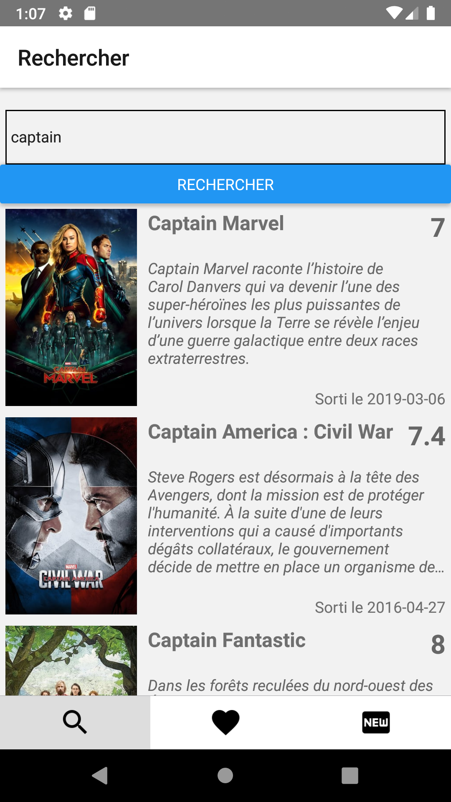

# MoviesAndMe
Mobile app for searching a movie from "the movie database" and adding it to your favorites

## Installation and Run

* Clone project
* `npm i`
* Set your API TMDB Token in /API/TMDBApi.js file
* `react-native run-ios` or `react-native run-android`

Check [TMDB API](https://www.themoviedb.org/documentation/api) for more informations about querying films.

# Result

 
